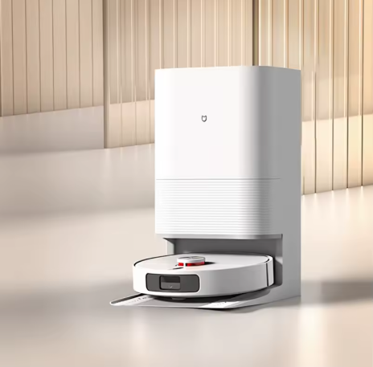
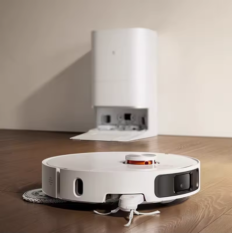
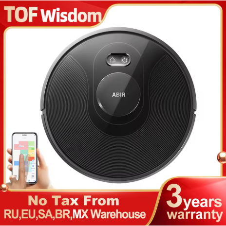

## Robot.Pro — Hebrew (RTL) Robot Vacuum & Mop Buying Guide

A marketing-grade, Hebrew (RTL) buying guide site built with Next.js (App Router), focused on SEO, model comparison, credible sources, and AliExpress affiliate links with clear disclosure.

- **Live**: `https://robot-web-six.vercel.app`

---

## What’s included

- **High-converting homepage** with rich content, internal links, and clear CTAs.
- **Long-form article** (`/article`) with a table of contents + Article JSON-LD.
- **Model comparison** (`/compare`) with cards, ratings, progress bars + a technical table.
- **FAQ** (`/faq`) with FAQPage JSON-LD.
- **Sources & links** (`/sources`) including manufacturers/reviews + AliExpress links.
- **Technical SEO**: `robots.txt`, `sitemap.xml`, canonicals per page, OpenGraph/Twitter.
- **Affiliate-ready**: `rel="nofollow sponsored noopener"` + disclosure.

---

## Images (from this repo)

Model images live in `public/images/robots/` and are used on the site (Home/Compare).

| Model | Image |
|---|---|
| Xiaomi Mijia M30S |  |
| Xiaomi Mijia M40 |  |
| ABIR X8 |  |

---

## Tech stack

- **Next.js 16 (App Router)** + TypeScript
- **Tailwind CSS** + a design system using **Design Tokens** in `app/globals.css`
- SEO via the Next Metadata API (`export const metadata`)
- JSON-LD via a dedicated component

---

## Run locally (development)

1. Install dependencies:

```bash
npm install
```

2. Start the dev server:

```bash
npm run dev
```

Then open: `http://localhost:3000`

---

## Run locally (production-like)

```bash
npm run build
npm run start
```

---

## Deploy to production (Vercel) — to update the live URL

1. Verify everything is tracked (including images):

```bash
git status
```

2. Commit and push to the GitHub branch connected to Vercel.
3. In Vercel → **Deployments**, confirm the latest deployment is **Ready**.
4. Open `https://robot-web-six.vercel.app` (Hard Refresh recommended: `Ctrl+F5`).

---

## Key files

- `app/page.tsx` — Homepage
- `app/article/page.tsx` — Long-form article + Article JSON-LD
- `app/compare/CompareClient.tsx` — Comparison cards + table
- `app/faq/page.tsx` — FAQ + FAQPage JSON-LD
- `app/sources/page.tsx` — External sources & links
- `app/data.ts` — Models data (stars/sold/reviews + affiliate links)
- `app/robots.ts` + `app/sitemap.ts` — Technical SEO
- `app/lib/seo.ts` — Metadata helper (title/description/canonical/OG/Twitter)

---

## Affiliate disclosure

Some links are affiliate links. We may earn a commission at no additional cost to you.

Required Hebrew disclosure (as shown on the site):

> גילוי נאות: חלק מהקישורים הם קישורי שותפים. ייתכן שנקבל עמלה ללא עלות נוספת עבורך.
